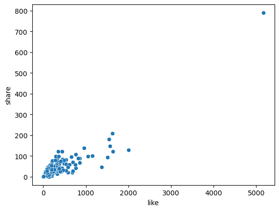
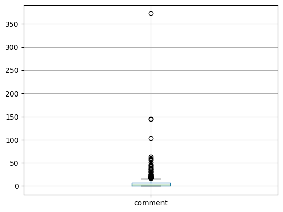
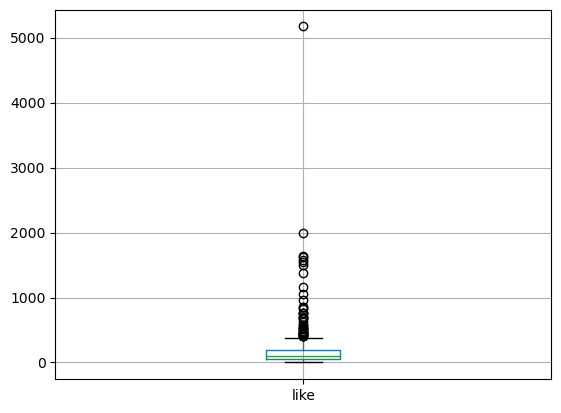
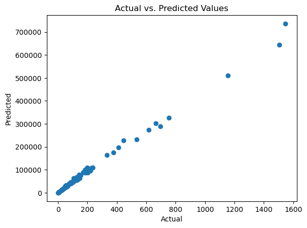
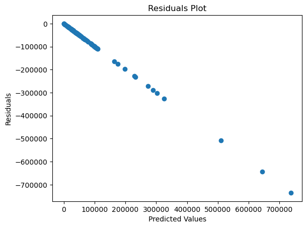

# Facebook_Metrics
[TEP] Phase 1 Portfolio Project
Facebook Metrics is analyzed in this end of phase portfolio project. Facebook is a popular social media plaotform with millions of users worldwide. Facebook is a place where people share photos, videos, video call, sell items, promote and conduct businesses and so forth. A set of metrics provdied by the University of California Irvine is used to conduct data analysis. Exploratory Data Analysis (EDA), Data Wrangling, pre-processing and  modeling is performed.
# Method Used
 Mathplotlib Python Numpy Seaborn Pandas Scipy Jupyter
# Technologies Used
Data Visualization 
T-Tests/P-Value 
Inferential Statistics
 Linear regression model
# Observations
A data is provided with a shape of (500, 19). There are 500 rows and 19 columns. The columns include: 'Page total likes', 'Type', 'Category', 'Post Month', 'Post Weekday', 'Post Hour', 'Paid', 'Lifetime Post Total Reach', 'Lifetime Post Total Impressions', 'Lifetime Engaged Users', 'Lifetime Post Consumers', 'Lifetime Post Consumptions', 'Lifetime Post Impressions by people who have liked your Page' 'Lifetime Post reach by people who like your Page', 'Lifetime People who have liked your Page and engaged with your post','comment', 'like', 'share', 'Total Interactions.' I immdiately got the intrest to see the correlation between a few of these using multivariate graphing. 
I hypothsize that there is a correlation between likes and shares in that an increase in shares, increases the amount of likes it gets. My hypothesis was proven right by the multivariate graph used to compare my data. The null hypothsis was is no correlation between shares and likes in a post. 

There’s a positive correlation between likes and total interactions. There’s no correlation between likes and post hours. There’s a positive correlation between like  and share. There’s no correlation between page total likes and lifetime post impressions by people who have liked your page. There is no correlation between post weekday and like. There is no correlation between the post weekday and page total likes. There is no correlation between page total likes and total interactions. There is no correlation between share and page total likes. There is a positive correlation between like and comment.
A few graphs had outliers such as share total interactions, lifetime, post impressions by people who have liked your page, like, and comment. I am choosing to leave these outliers in our data, because there could be a reasons why it’s there, such as: a pregnancy announcement post, a birthday post, a graduation post, a marriage engagement post, and much more that will cause more of these to flare up.
  

In our data modeling, we used linear regression. Linear aggression is a statistical method used to model the relationship between a dependent variable, and a more independent variable by fitting a linear equation to the observed data. It’s used to predict a continuous dependent variable, which is the target variable based on more independent variables, which are the predictive variables. In my analysis, the target variable turned out to be “like” I wanted to see how this worked with other more independent variables. The steps taking where to train the data, scale it, and then do the linear regression. A regression line can be used to predict the value of Y for given value of X.  A positive slope is observed in the actual versus predictive values plot, which means that there’s a strong correlation between the models predictions and the actual result. On other hand on the residual plots, we see more of a negative slope, or a declining slope, which could be the way due to it suggesting that the model is not capturing the underline linear relationship and the data adequately.

# Future steps
Future steps I could take on this project could be checking the model specification. This means ensure that the model is correctly specified and includes all relevant predictors. It might be necessary to explore interactions or nonlinear terms. I could also transform variables. I could consider transforming variables, either through log transformations, power transformations, or other methods, to better capture the underlying relationship. I could have also used a different model. If the relationship is clearly nonlinear, it is fair to consider using a nonlinear regression model or other machine learning algorithms that can capture more complex patterns.
